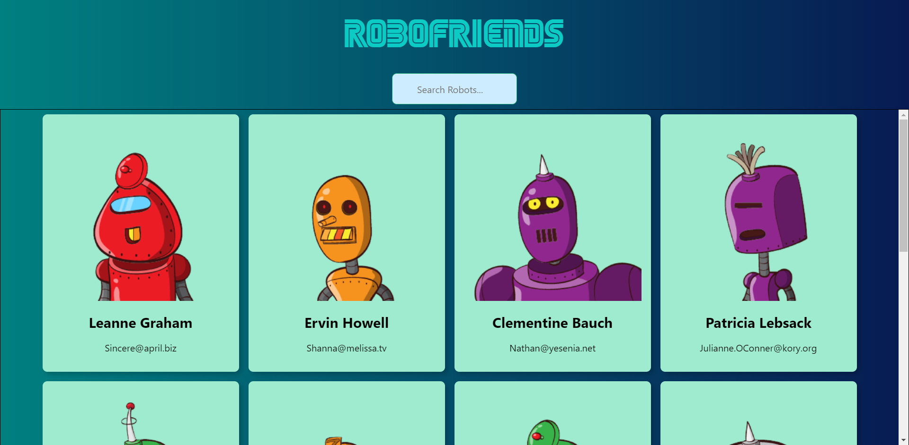
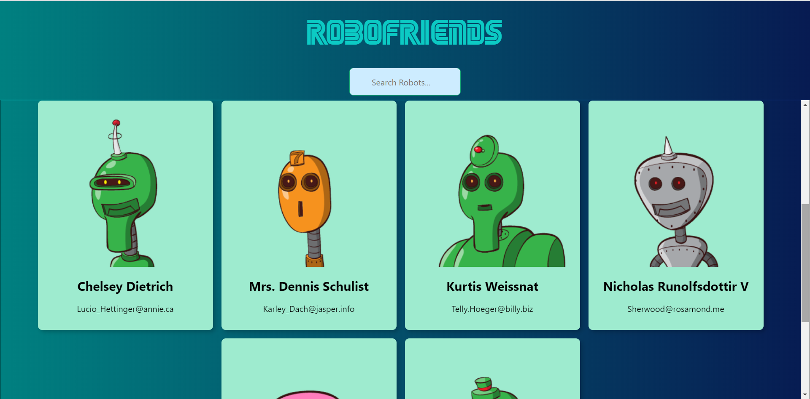

# RoboFriends

A simple React based App that searches the robots it has on the website.

Its a Basic react app that covers the core concepts of react.

##### Topics Covered

- Props
- State
- Children
- Function & Class components (Pure components & Smart components)
- JSX
- Fragments

### Screenshots

---

You can run this app by using the steps below

##### `clone this repo`

In the project directory, you can run:

##### `npm install`

It installs the dependencies (if any) using the package.json file.

##### `npm start`

Start and runs the app which renders in real-time.

##### `npm run build`

Builds the app for production to the `build` folder. 
It correctly bundles React in production mode and optimizes the build for the best performance.

Your app is ready to be deployed! 
Cheers Mate!🍻
